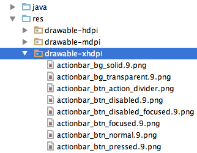
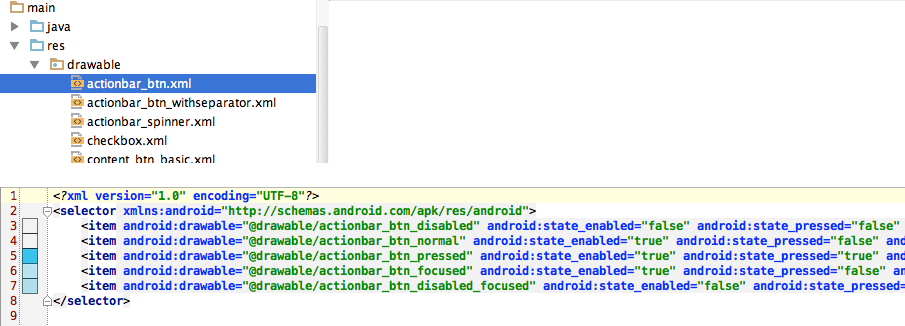

# SelectorChapek for Android

This Android Studio plugin automatically generates drawable selectors from appropriately named Android resources.

## How to install it:

 - in Android Studio: go to `Preferences→Plugins→Browse repositories` and search for `SelectorChapek`

 _or_

 - [download it](http://plugins.jetbrains.com/plugin/7298) and install via `Preferences→Plugins→Install plugin from disk`

## How to use it:

1) Right-click folder with your resources e.g 'drawable-xhdpi'

 

2) Select 'Generate Android Selectors'

 

3) All selectors _automagically_ appear in the 'drawable' folder!

 

## Naming convention:
In order of plugin to work, resources need to be appropriately named. The plugin supports png or nine-patch files with certain suffices anywhere in the file name. You can also combine any suffixes together.

### Mapping 

| File name suffix 		| Drawable state 		|
| --------------------- | --------------------- |  
| _normal 		   		| (default state)		|
| _pressed         		| state_pressed			|
| _focused         		| state_focused			|
| _disabled        		| state_enabled (false) |
| _checked		   		| state_checked   		|    
| _selected		   		| state_selected  		|   
| _hovered         		| state_hovered   	   	|
| _checkable	   		| state_checkable 		|   
| _activated	   		| state_activated 		|   
| _windowfocused   		| state_window_focused 	|

## Wishlist

 - UI which will tell you which selectors will be generated
 - possibility to change naming mapping

_Pull requests are welcomed!_

## Why 'Chapek'?

[Karel Čapek](http://en.wikipedia.org/wiki/Karel_%C4%8Capek) was a famous Czech writer, inventor of the word 'robot'. The word comes from Czech word 'robota', which means 'hard manual labor'. As with Čapek's robots, this plugin will remove your unnecessary manual labor. 
